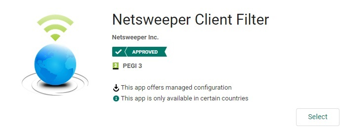
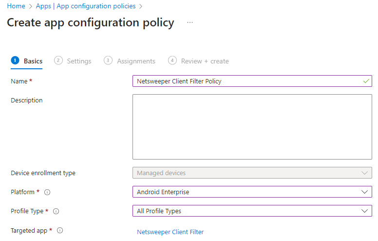
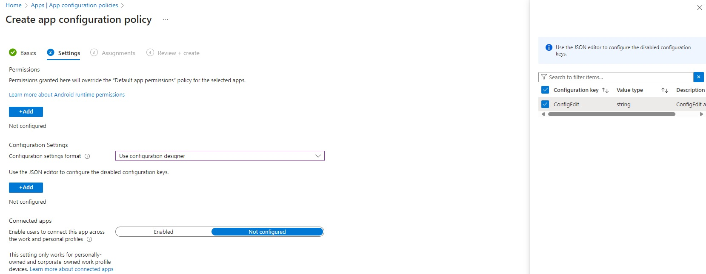
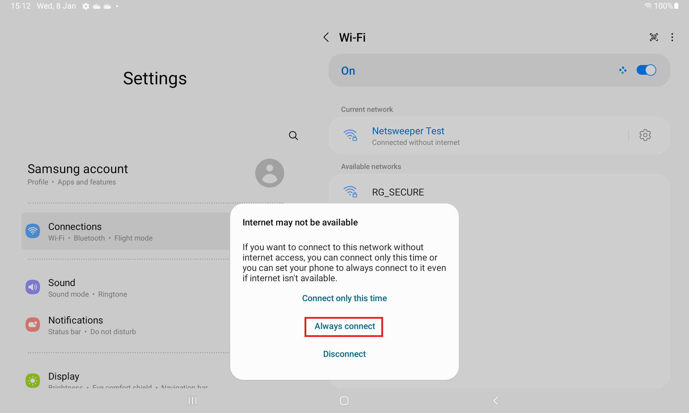

---
date:
    create: 2025-10-17
tags:
    - Android
    - Google
---
# Android


## Requirements

!!! Warning "MDM"
    A MDM Solution is required to use the Client Filter on Android

## Limitations
Android devices require a connection to [www.google.com](https://www.google.com){:target="_blank"}  to verify internet connectivity, so an Android device going through Netsweeper will report that it has no internet connection

The Netsweeper workaround is to add a new CNAME record on your local DNS server for your [local Google domain(s)](https://www.google.com/supported_domains){:target="_blank"} that points to **forcesafesearch.google.com**

Ideally any Android devices would need to be on a separate VLAN due to not inspecting the Google traffic.

!!! Warning "MDM Required for Client Filter"
    The Netsweeper Clinet Filter is a browseer replacement. To install the client filter on an Android device this needs to enrolled into a MDM solution, otherwise we can only provide filtering.

## MDM Guides

### Intune

#### SSL Certificate

In Intune click "Devices" -> "By Platform" -> "Android" -> "Configuration"

[android-ssl1](media/android/android-ssl1.png)

Select "+ Create" -> "New Policy"

[android-ssl2](media/android/android-ssl2.png)

Select the following:

Plaform = Android Enterprise
Profile Type = Templates
Template Name = Trusted Certificate

[android-ssl3](media/android/android-ssl3.png)

Give the configuration a name

[android-ssl4](media/android/android-ssl4.png)

Browse to the SSL certificate

[android-ssl5](media/android/android-ssl5.png)

On the next screen assign this to a group or all devices

[android-ssl6](media/android/android-ssl6.png)

Now on the last screen click "Create" and the configuration should appear within a couple of minutes.

#### Client Filter

This guide assumes Android devices are already enrolled and a Managed Google Play has been linked

Ensure the device is enrolled with "Corporate-owned, fully managed user device", if the device is enrolled with Kiosk enrollment we will not be able to return the username.

In "APPS" -> "Android" click the "+ Add", and select the "App Type" "Managed Google Play app" in the Google Play screen search for "Netsweeper" and select the "Netsweeper Client Filter" app



Once this appears in the App list, select the App and assign the required groups. Once this is done the App should start pushing out to the groups selected. However we now need to create an "App Configuration Policy" to push the settings out to the device

Under "Apps" -> "App configuration policies" click "+ Create" and select "Managed Devices", on this screen you will need to give the configuration policy a name such as "Netsweeper Client Filter Policy", Select the platform this should be "Android Enterprise", the "Profile Type" should match the profile type you need, I select "All Profile Types", once you have completed these you will be able to select the "Targeted app" which should be the "Netsweeper Client Filter" app



On the next page under "Configuration Settings" select "Use configuration designer" and the tick the box for "ConfigEdit" and click "Ok"



The ConfigEdit value should be a "string" with the configuration value

``` text
-p filter.wavenetcloud.netsweeper.com:3431 -y {Brand} -f 958209 -d {DFE-Code} -g nsw_pupil -n {{partialupn}} 
```

the {{partialupn}} is a Intune variable which returns the username

## Connecting to a Wireless Network

When connecting to the WiFi network you may get the "Internet may not be available" message, on here click the "Always connect" option

