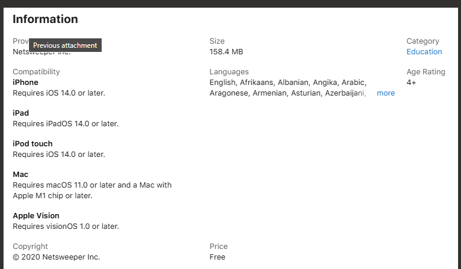
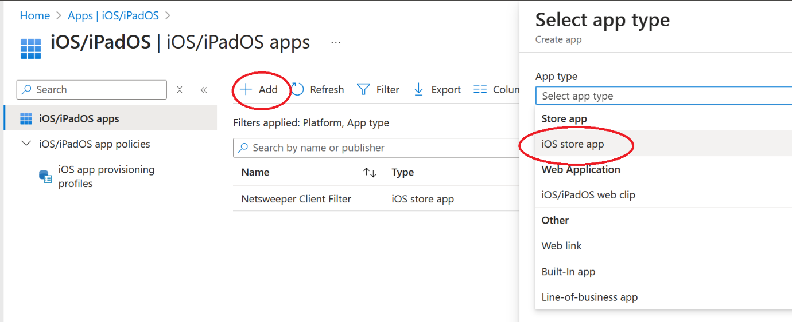
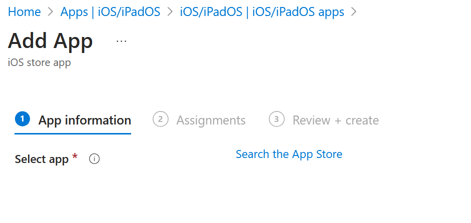
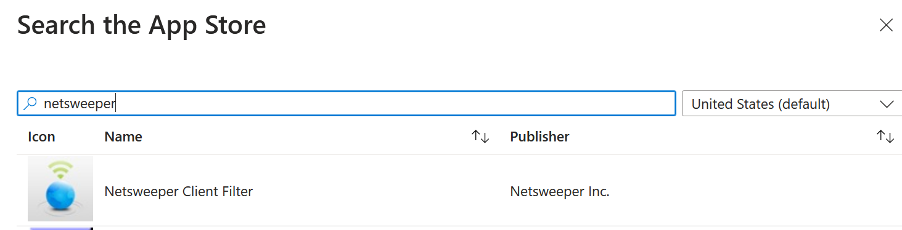
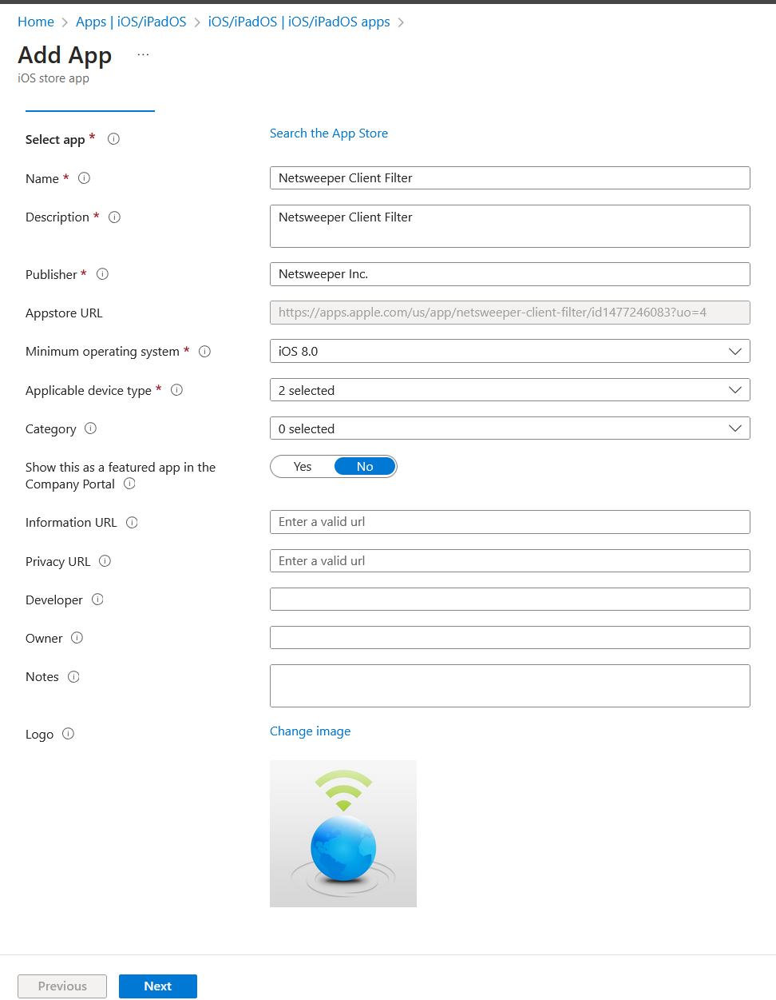
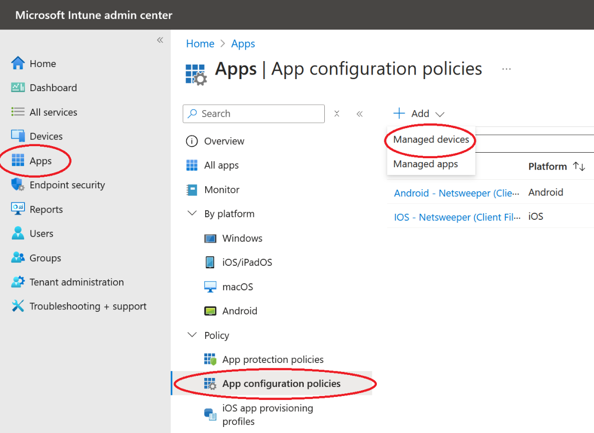
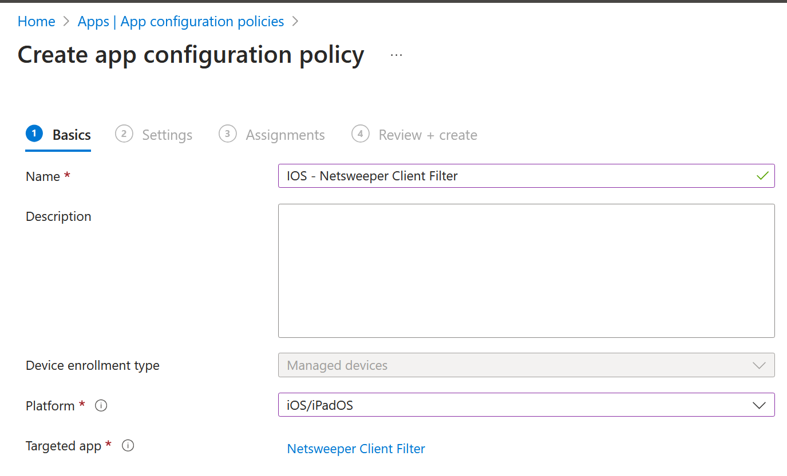
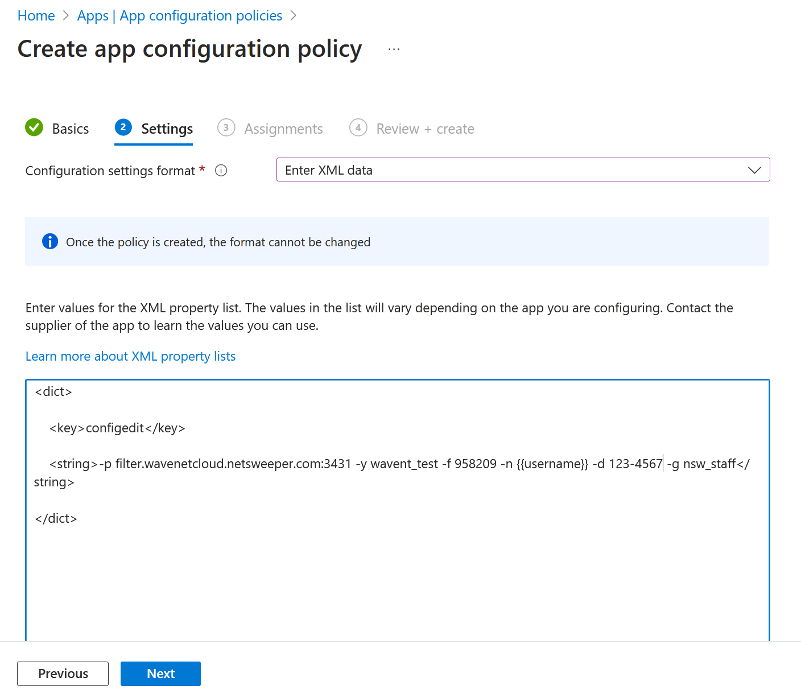

---
date:
    create: 2025-10-17
tags:
    - Apple
    - IOS
    - iPad
    - MacOS
---
# Apple

The nMonitor app should be purchased from the MDM (this is free). nMonitor is a replacement browser and to ensure monitoring is effective any other browsers should be disabled via the MDM

Where a MDM is not in-place we can only install the SSL certificate and enable filtering on the devices, note this would be a manual process adding time to the project.

## Requirements

!!! Warning "MDM"
    A MDM Solution is required to use the Client Filter on IOS

For the IOS replacement "Clint Filter" browser the device must be running IOS 14.0 or later



## MDM Guides

### Intune

#### SSL Certificate

#### Clint Filter (Replacement Browser)
To setup Microsoft Endpoint Manager for you will need to have the client filter plist files prepared already.

Login to: [Intune Admin](https://intune.microsoft.com){:target="_blank"} 

Then go to “Apps” -> “iOS/iPadOS”


Then click “+ Add” and then on the new blade select the drop down and “iOS store app” once selected click “Select”



On this next screen select “Search the App Store”



Search for “Netsweeper” this returns the fewest results



Once selected you will the following screen



Click “Next” and the assign to the groups / devices that should be receiving the app. Then on the next screen click “Create”.

Once the App is created, we need to push the configuration out to the App. To do this we need to create a configuration policy in “App Configuration Policies”.

Still under “Apps” click the “App configuration policies" then click the “+ Add” and select "Managed Devices.



On this next page we need to complete the following:

Name – Should be something identifiable (e.g. IOS – Netsweeper Client Filter – Pupil)

Platform: iOS/iPadOS

Targeted app: click “Select app” and find the “Netsweeper Client Filter” in the list



The next screen we need to import the plist settings, for “Configuration settings format” I select “Enter XML data”, now in the box at the bottom we need to enter the XML from the plist, inTune only accepts the XML between the tags <dict> and </dict> as below:



Click “Next” and assign to the required groups and the under “Review + Create” click “Create”

```xml
<?xml version="1.0" encoding="UTF-8"?\>

<!DOCTYPE plist PUBLIC "-//Apple//DTD PLIST 1.0//EN"
"http://www.apple.com/DTDs/PropertyList-1.0.dtd"\>

<plist version="1.0"\>

<dict\>

    <key\>configedit\</key\>

    <string\>-p filter.wavenetcloud.netsweeper.com:3431 -y
netsweeper_brand -f 958209 -n {{username}} -d DFE-CODE -g nsw_pupil@DFE-CODE -a DFE-CODE -A DFE-CODE</string\>

</dict\>

</plist\>
```

### Moysle

``` xml
<dict>
    <key>configedit</key>
    <string>-p filter.wavenetcloud.netsweeper.com:3431 -y netsweeper_brand -f 958209 -n %DeviceName% -d DFE-CODE -g nsw_pupil -a DFE-CODE -A DFE-CODE</string>
</dict>
```
In Mosyle the available variables are shown when you go to create the app configuration, the most useful will be %DeviceName% (make sure no spaces in the name) and %SerialNumber%

### JAMF

### Lightspeed

``` xml
<?xml version="1.0" encoding="UTF-8"?\>

<!DOCTYPE plist PUBLIC "-//Apple//DTD PLIST 1.0//EN"
"http://www.apple.com/DTDs/PropertyList-1.0.dtd"\>

<plist version="1.0"\>

<dict\>

    <key\>configedit\</key\>

    <string\>-p filter.wavenetcloud.netsweeper.com:3431 -y
netsweeper_brand -f 958209 -n %devicename%@123-4567 -d 123-4567 -g nsw_pupil\</string\>

</dict\>

</plist\>
```
Notice LightspeedMDM requires the DFE code on the "-n" as well as the "-d" options, also note that device names will not show correctly if they have a space in the name.

### Meraki

## Manual SSL Installation

To manually install the SSL Certificate see Apple support: [Trust manually installed certificate](https://support.apple.com/en-us/102390){:target="_blank"}