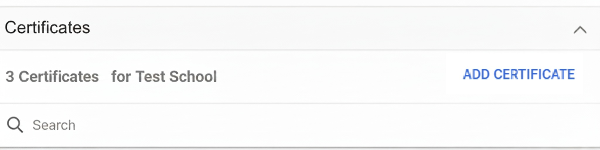

---
date:
    create: 2025-10-17
---
# Google Chromebook

## Requirements

Chromebooks simply require to be licenced within the Google Admin console, if they aren't licenced and they are stand-alone they can only be used on the filtering and the SSL Certifcate would need to be installed manually (**Chromebook manaul SSL installation is not covered in this guide**)

## Google Admin

### SSL Certificate

Login to: [Google Admin](https://admin.google.com)

Go to Devices -> Networks and then find the "Certificates" section and click on this section


On this Click the "Add Certificate"



Give the Certificate a name and click "UPLOAD" and browse to the certificate file to upload this. Make sure "Enabled for Chromebook" is ticked


### Wagent

The ChromeOS Netsweeper wagent extension ID is: "gehcmbonedocjpdjfemeklocmmpedmoj" [Chrome Wagent Store Page](https://chromewebstore.google.com/detail/netsweeper-workstation-ag/gehcmbonedocjpdjfemeklocmmpedmoj)

The below JSON should be amended and applied to the "Policy for extensions" section

``` JSON
{
  "NS_WAGENT_ARGS": {
    "Value": "-w wavenetcloud.netsweeper.com -d nsagent-login.netsweeper.com -g {LOGIN_GUID} -L {LOGOUT_GUID} -i -l -v"
  },
  "NS_WAGENT_SOFTWARENAME": {
    "Value": "Netsweeper Workstation Agent"
  }
}
```

### Client Filter

The Chrome extension ID that is required by the onGuard (Client Filter) is: “kdbgbpcphmnekmkhbcfmbdahceffhddn” [Chrome Client Filter Store Page](https://chromewebstore.google.com/detail/netsweeper-client-filter/kdbgbpcphmnekmkhbcfmbdahceffhddn)

The below JSON should be amended and applied to the "Policy for extensions" section

``` JSON
{
   "policyserver": {
      "Value": "filter.wavenetcloud.netsweeper.com:3431"
   },
   "makeopts": {
      "Value": "-y {BRAND} -f 923649 -g {nsw_group} -d {DFE-Code} -t 987"
   },
   "whitelist": {
      "Value": [
         "stylesheet://, 1",
         "script://, 1",
         "image://, 1",
         "font://, 1",
         "object://, 1",
         "ping://, 1",
         "csp_report://, 1",
         "media://, 1",
         "websocket://, 1",
         "other://, 1",
         "filesystem:, 1"
      ]
   }
}
```
