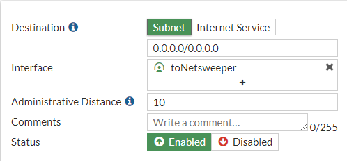
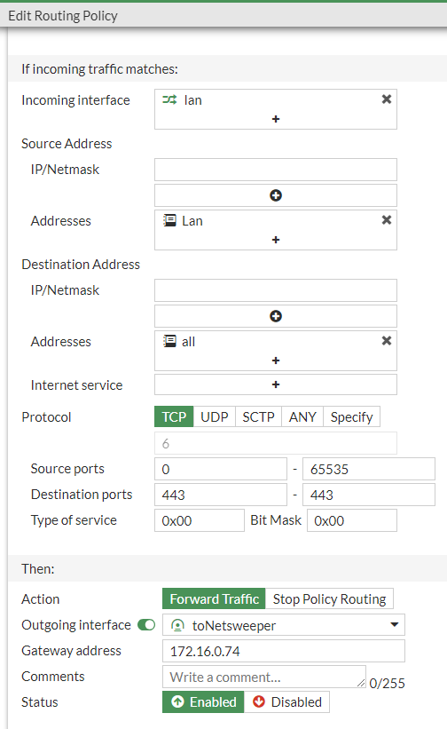
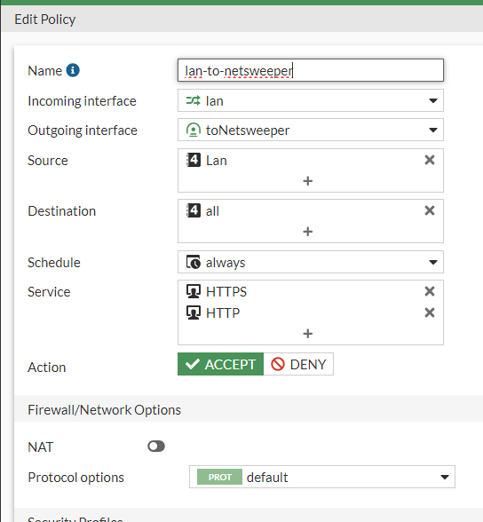

---
date:
    create: 2025-10-17
tags:
    - Fortigate
---
# Firewall Configs

The preference for moving traffic to Netsweeper is via a GRE tunnel assuming the Firewall supports this, if not we have the option of using IPSEC

The downsides to IPSEC are the overhead of encrypting the data, setting a FortiGate up to route all traffic via the IPSEC will cut off remote connections making the IPSEC only possible if you are onsite.

We need to advise Netsweeper which type of tunnel we are using when onboarding the customer, though this can be changed later, changing an active tunnel will mean disrupting the filterring. 

!!! Note "Firewall Configs"
    This is a Netsweeper only guide and does not cover other firewall security that should be applied.

## FortiGate

### Enable Advanced Routing

### GRE Tunnel Configuration

This is done via the CLI and cannot be completed via the GUI, the details below are a guide and the highlighted items are the items that change from site to site.

``` bash
config system gre-tunnel
edit "toNetsweeper"
set interface wan
set remote-gw {Netsweeper IP}
set local-gw {Customer IP}
next
end

config system interface
edit "toNetsweeper"
set vdom "root"
set ip 172.16.0.73 255.255.255.255
set allowaccess ping
set type tunnel
set remote-ip 172.16.0.74 255.255.255.252
set snmp-index 12
set interface wan
next
end
```
### Static Route to Netsweeper

Create a static route for 0.0.0.0/0 with the interface set to the “toNetsweeper” interface.



### Policy Route

We need to create policy routes on the FortiGate for the following:

TCP/UDP 443

TCP/UDP 80

This can be either completed via the CLI or GUI, the code is below

``` bash
edit 0
set input-device "lan"
set srcaddr "Lan"
set dstaddr "all"
set protocol 6
set start-port 443
set end-port 443
set gateway 172.16.0.74
set output-device "toNetsweeper"
next

edit 0
set input-device "lan"
set srcaddr "Lan"
set dstaddr "all"
set protocol 17
set start-port 443
set end-port 443
set gateway 172.16.0.74
set output-device "toNetsweeper"
next

edit 0
set input-device "lan"
set srcaddr "Lan"
set dstaddr "all"
set protocol 6
set start-port 80
set end-port 80
set gateway 172.16.0.74
set output-device "toNetsweeper"
next

edit 0
set input-device "lan"
set srcaddr "Lan"
set dstaddr "all"
set protocol 6
set start-port 3431
set end-port 3432
set gateway 123.123.123.123
set output-device "wan"
next

end
```
Here is the GUI setup, this shows TCP 443 for the others change the Protocol and Destination Ports



### Firewall Policy

We need at least 2 policies creating, the first is to disable QUIC TCP/UDP 80 & 443 this should really already be implemented. The second rule is to allow HTTP(S) traffic from LAN to “toNetsweeper” with NAT disabled.

My preference for this rule would be to split this out per VLAN so egress traffic can be monitored per VLAN



Where onGuard is used we need to create a policy for TCP port 3431 & 3432 from the LAN to WAN with a destination address of either the FQDN “filter.wavenetcloud.netsweeper.com” or to the IP “185.222.115.98” this will ensure that no other proxy can get outbound traffic on these ports.

For completeness a deny should be inserted for any HTTP(S) from LAN to WAN so in the event of a VPN failure web traffic stops.

## WatchGuard

Coming soon