---
date:
    created: 2025-10-17
tags:
    - Netsweeper
    - Webadmin
---
# Netsweeper Webadmin

## Logon to Netsweeper Webadmin

browse to: [https://wavenetcloud.netsweeper.com/webadmin/start](https://wavenetcloud.netsweeper.com/webadmin/start){:target="_blank"} 

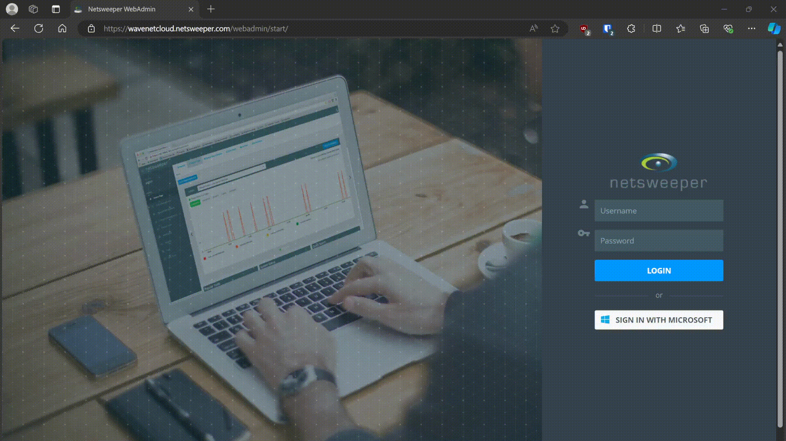

If you don't have a logon account contact the helpdesk

## Groups & Policies

### Groups

In Policies -> groups if the groups haven’t been created or we need additional groups and this is a basic school setup then click the “+”

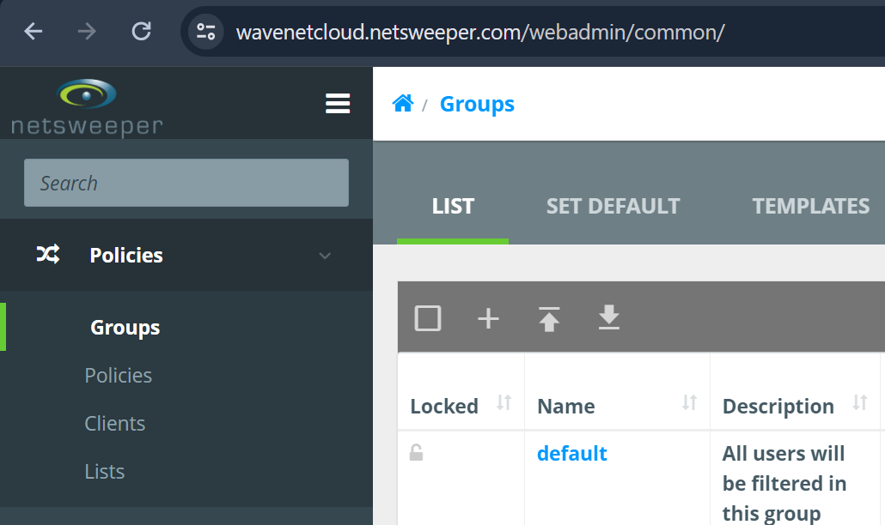

On the group creation screen, we need to enter the group name, notice here we are appending the group name with the DFE code. We put the school name in the description to aid searching.


Once you have pressed submit the following screen will load. If not click the "Policies" option on the top bar

Under "General" change the name to match the "group name" e.g. nsw_staff@000-0000

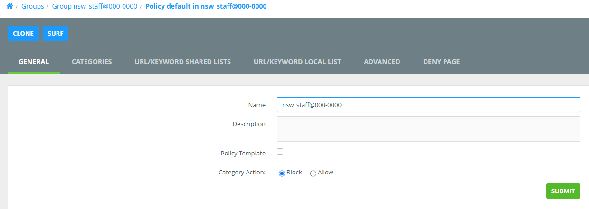

In this screen click "List" and then click on "default" or "nsw_staff@00-0000" this will load the "default" policy

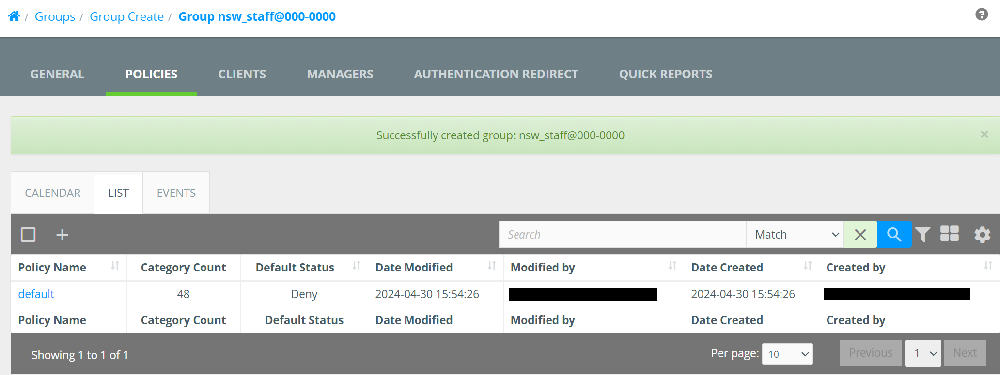

Now Select "Categories" and change the drop down to one of the following:

* Wavenet - School
* Wavenet - School Teacher
* Wavenet - School Admin

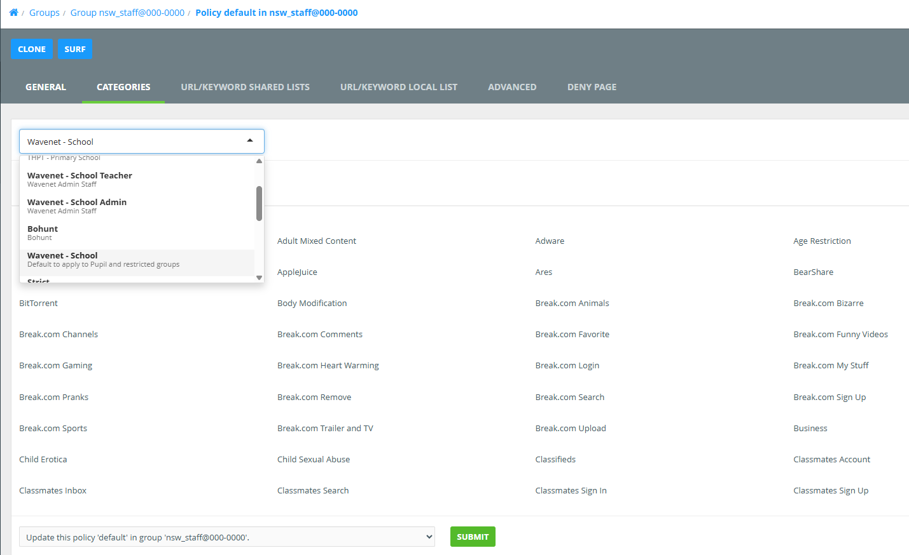

Make sure you click the "Submit" on this screen.

Now under "URL/KEYWORD SHARED LISTS" under "Available Lists" select the below:

**For Pupil**

* Aruba Central
* Decryption
* Exceptions - Decrypt List
* Filter Bypass List
* Intune
* Inventry
* JAMF
* Legacy Selective Decryption
* LightspeedMDM
* NS Exceptions - Decrypt List
* NS Exceptions - Mac OS
* NS Exceptions - Windows
* RMM
* Selective Decryption
* Sophos
* System Allow List
* System Deny List
* System Wide Search Keywords
* System Wide Search Keywords2

**For Staff**

Select the above that we selected for Pupil and the following:

* Disney+
* Netflix
* School Admin
* Twitter
* Vimeo
* YouTube

Now select the "URL/KEYWORD LOCAL LIST" here you can add allow / deny websites for the specific group

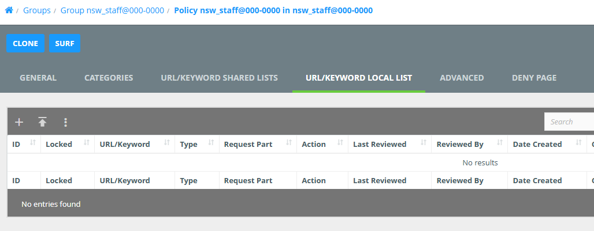

### Clients

“Policies” -> “Clients” this is the local networks used by the schools click the “+” to add a new network
**Group** – this should be the pupil groups
**Client Type** – set this to “Network Subnet”
**Client Settings:**
**Client Name** – name@dfe-code e.g. wireless@123-4567
**IP Address or Range** – This should be the Network Address e.g. 10.1.2.0
**Subnet Mask**: this should be the subnet mask for the network e.g. 255.255.255.0

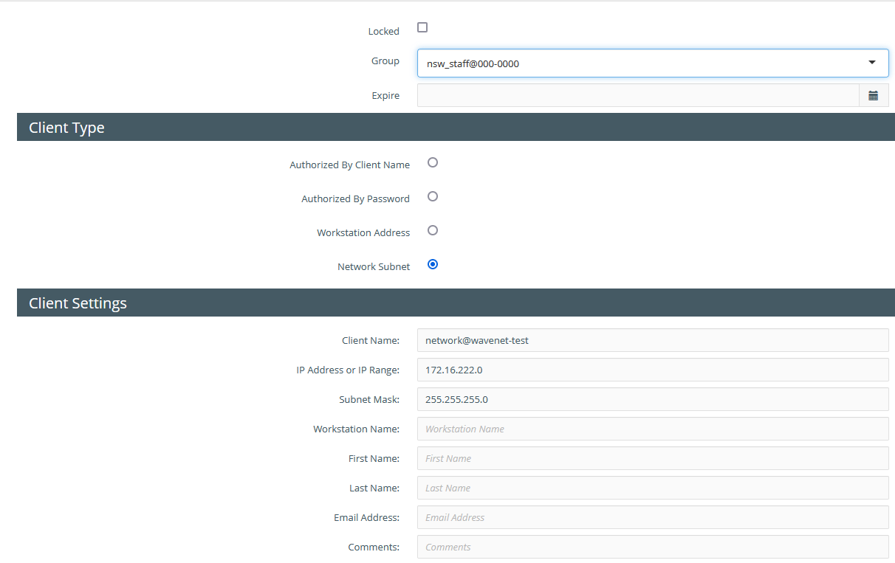

### Lists

In lists we can create 2 kinds of list “Local” and “Shared” lists, I would recommend creating “Shared” lists as these can be re-used for other Policy Groups

To Create a list click the “+”

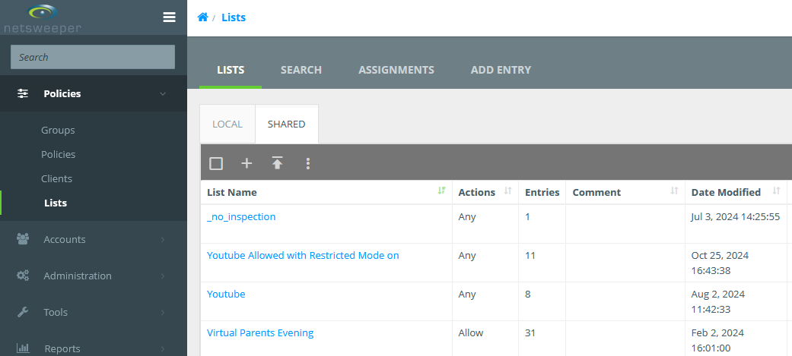

On this next screen we need to name the list this should be either the trust name or DFE code and usage such as “allow” or “deny” e.g. “123-4567 – allow” so we can identify where lists are used or controlled by. Comments is not required but can be helpful in identifying how the list is used.

List assignments this can be left blank but Don’t tick **“System Wide List”** or **“Filter Bypass List”**

Restrictions this forces the list to be a particular type e.g an allow list this can be left blank and the list used for multiple purposes. Though usually we would tick “allow”, “deny” etc.

The “Add Sysop” should be used to add any other people to view or manage the list.

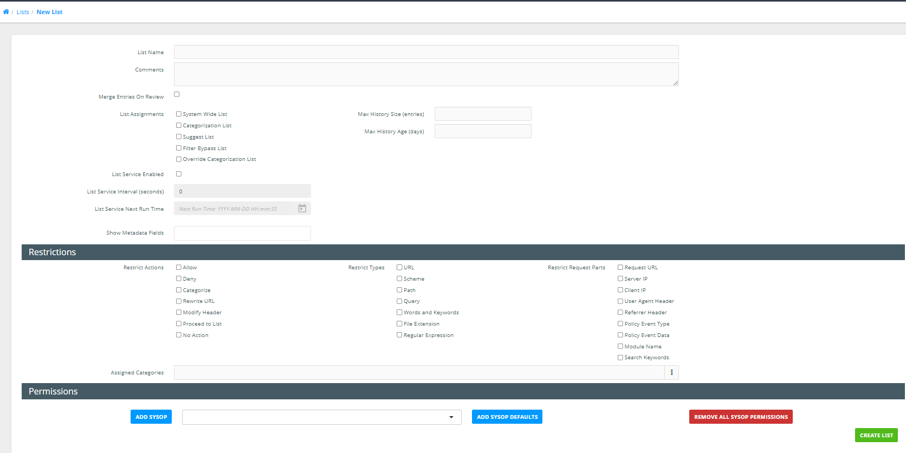

## Acounts

To create a user account for the end users go to “Accounts” -> “Accounts” and click the “+” on the next screen select “Advanced”

!!! Warning "Login Name"
    The Login Name email address field is case sensitive
Login Name – needs to be the email address of the user
First name:
Last name:
Email Address – this should be the users email address
Organization – This should be the school name
Account Password – this should be complex and no longer than 15 characters
Classification – should be “Sysop”
Account Template – this will vary depending on the site but generally this would be any of the “Customer” prefixed group.
Change password on login – tick this box

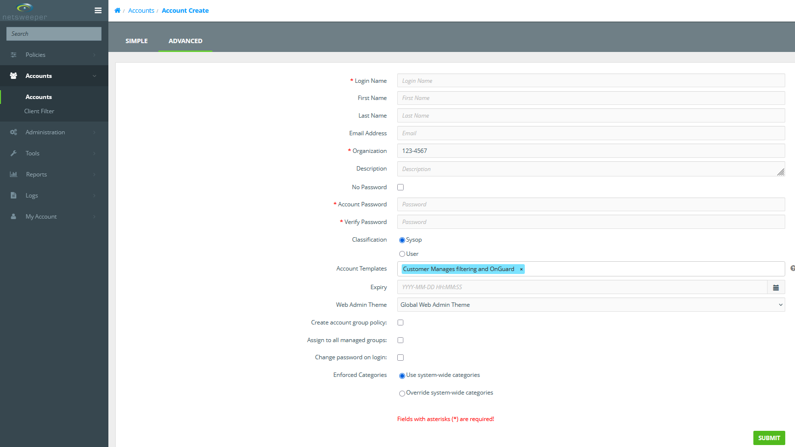

Once the user is created you can then go back in and select the “Groups” tab and assign to any groups the user should see.

## Tools

### Wagent

Under “Tools” -> “Agent” click the “+”
Configuration Name - this should be the schools DFE Code
Comments – should be the school name
Client Settings:
Cleanup All Expired IP Addresses - should be ticked
Expire Clients on Logout – should be ticked
Max Login Sessions – this should be set to 5 or 10 but never unlimited
Append to User Name – this should be the schools DFE Code e.g. 123-4567
Group Settings:
Append to Group – should be the schools DFE Code e.g. 123-4567
Client Default Groups – should be pupil group e.g. nsw_pupil@123-4567

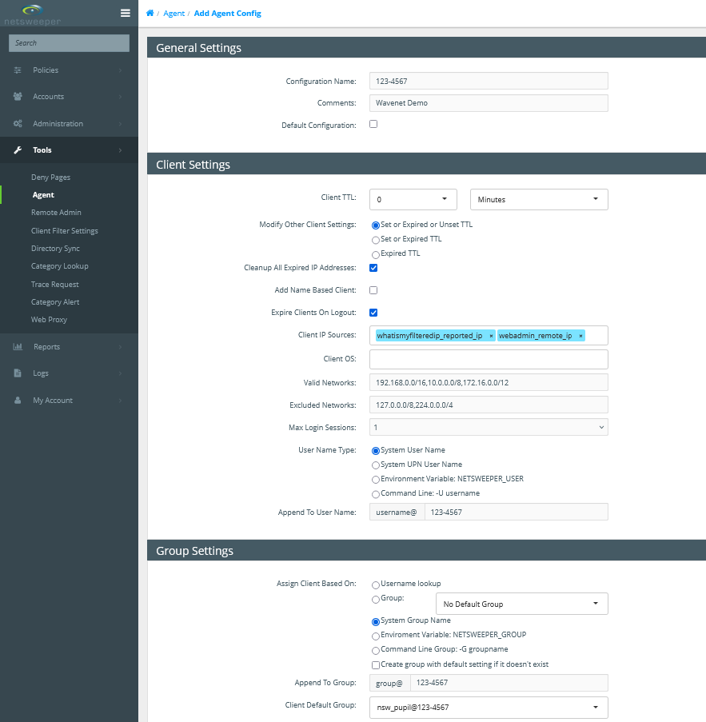

### Client Filer (onGuard)

Client Filters are used for the onGuard monitoring, setting these up as per the below
Under "Tools" -> "Client Filter Settings" click the "+"


On the next screen, we need to complete the following:

* Name
* Restrict to Platform – if this is the first Client Filter for a school then leave as “All Platforms” if not then set as required
* Description – make sure this has the School name and DFE as a minimum

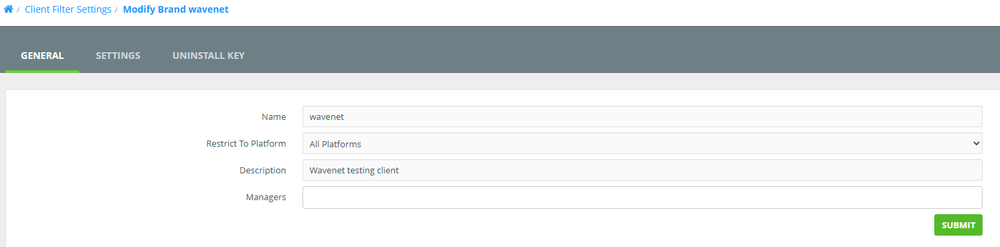

Click Submit and then go into Settings.

* "Liger First Time Login Redirect" should be set to **"RUS no Profile"**
* "Local Network Detection Network" should be with the following (Where 123.123.123.123 is the external IP address)
``` text
0.0.0.0 rus
123.123.123.123 allow
```
* "Request Context IP Address" this can be found under "Administration" -> "Services" but should be supplied by Netsweeper Support
* "nFilter Config" in most cases this will be blank
* "nMonitor Config" should be in most cases the below:
``` text
--webadmin=https://wavenetcloud.netsweeper.com/webadmin/ --log=1 --ocr_disabled=0 --ocr_image_compare_disabled=0 --ocr_matched_category_compare=0 --ocr_disable_words_compare=0 --ocr_disable_input_compare=0 --ocr_timeout_recapture=5 --keylog_disabled=0 --keylog_buffer_size=1024 --keylog_timeout_send=1 --keylog_timeout_clear=30 --image_quality=50 --image_target_width=0 --image_target_height=0 --tray_disabled=0 --tray_menu_disabled=0
```
* "nUpdate Config" should in most cases be blank, but to force a Client Filter update from Netsweeper
``` text
--enabled=1 --url=https://upgradecf.netsweeper.com/clientfilter/netsweeper/untested/Netsweeper%20Client%20Filter%20-%2013.10.55.55%20win64.json --log=3
```

### Directory Sync

The directory sync on the Hosted Netsweeper should only be used in more complex deployments such as sites that use EntraID, Google or where something like Radius is used on-site for BYOD authentication

#### Active Directory Sync

To add a Directory Sync go to “Tools” -> “Directory Sync” and client the “+”

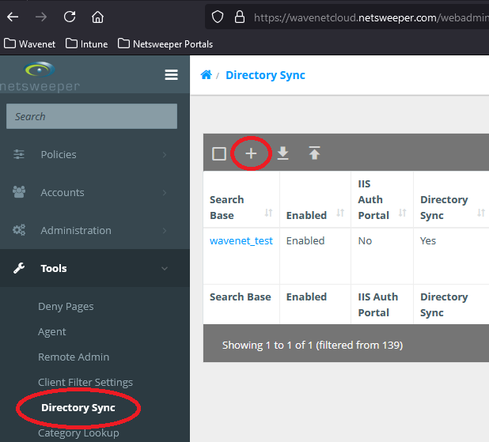

On the next screen complete the “Search Base Name” usually we use the DFE code and school name and tick the “Enable Directory Sync Service” checkbox and click submit, this then puts you back at the Directory Sync main page, search for the newly created Directory Sync and click the “Search Base” to edit.

On this page we need to select the Directory Type, this is usually “Windows Active Directory”, the “Connection String” should be the account DistinguishedName, “Password” is the account password and “Search Base” should be the location of the groups, this can be set as the root of the domain. Next we set the Append Group and Append Client these are both to be the school DFE Code, “Clone from Template” can be set to a template usually we opt for “Wavenet Template”. The “Managers” only needs completing when a 3rd party will be managing.


Servers is Domain Controller, when you click Add server enter the IP of the server this will mostly be the external IP of the customer with a port forward, but in some cases this will be the internal address depending how we present to Netsweeper, once the IP is entered you can click “Test Connection” and test the link

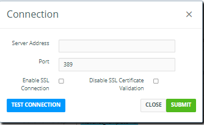
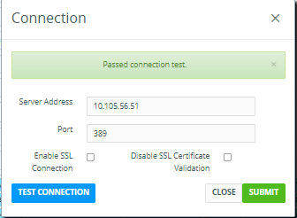

The Prefix should be set to “nsw_” this is to identify the filtering groups we created in Active Directory.

To Force a Sync with Active Directory click “Sync Options” at the top right and then click “Run a Complete SYNC”


#### EntraID Sync (Microsoft Graph)

Follow this [Netsweeper guide](https://helpdesk.netsweeper.com/docs/8_2_Docs/8_2_Netsweeper_Docs/Content/Tools/Directory_Sync/Azure_Directory_Sync/Microsoft_Graph_Directory.htm?Highlight=entra){:target="_blank"} to setup the EntraID sync

### Category Lookup

The Category Lookup can be used to identify which categories a site belongs to

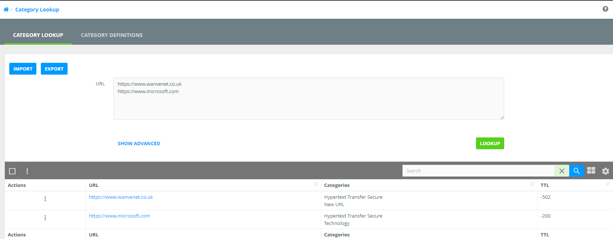

### Trace Request

The Trace Request screen allows us to trace a URL through the Netsweeper system, the following shows the options, we need to complete any one of “Client Name”, Client IP Address”, “Group Name” or “Policy Name” in the top half and then “URL” or “Destination IP Address" in the second half.

The “Show all Steps” should also be selected to show all the steps taken

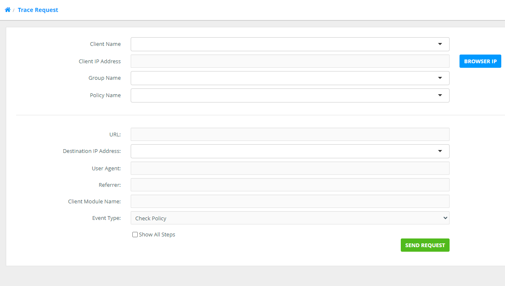

This is an example of a completed trace request showing all the steps for the site 888.com

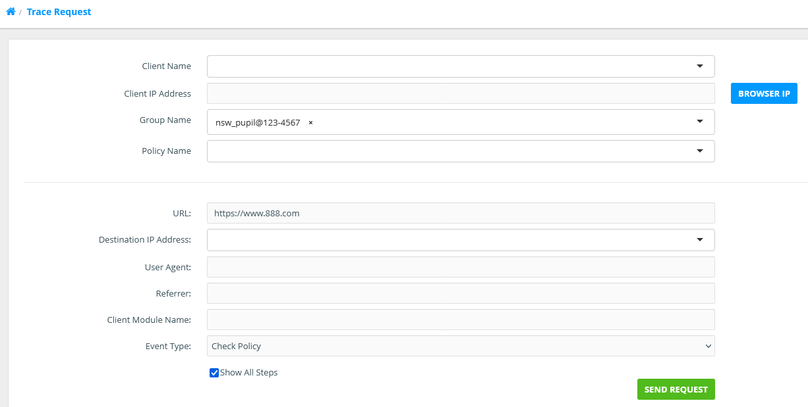

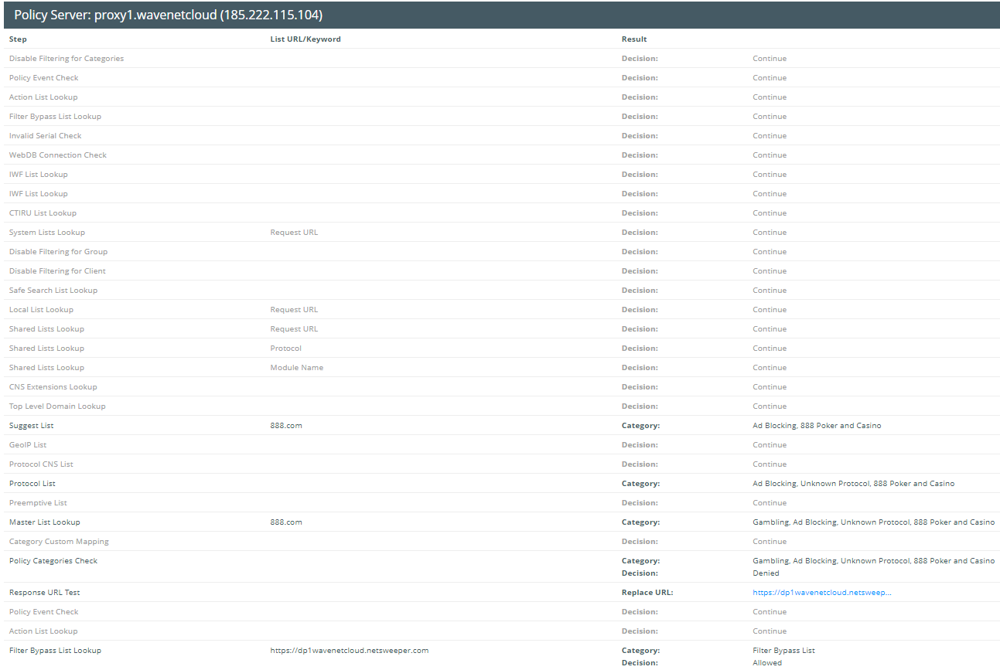

## Reports

## Logs

### Directory Sync Logs

The Directory Sync Logs can be useful in diagnosing issues with the "Directory Sync" for testing you should change the Directory Sync "Log Level" to "Debug"

!!! Note "Log Level"
    Remember to set this back to "INFO" once issue is resolved.

### Request Logs

This is possibly the best troubleshooting feature we have access to where the traffic can be monitored, you will only see the logs for the groups / Networks you have permissions for.