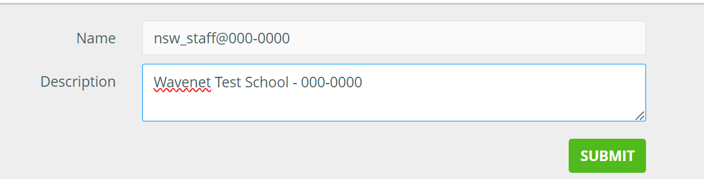

---
date:
    created: 2025-10-17
tags:
    - Netsweeper
    - Webadmin
---
# Netsweeper Webadmin

## Logon to Netsweeper Webadmin

browse to: [https://wavenetcloud.netsweeper.com/webadmin/start](https://wavenetcloud.netsweeper.com/webadmin/start){:target="_blank"} 

If you don't have a logon account contact the helpdesk

## Groups & Policies

### Groups

In Policies -> groups if the groups haven’t been created or we need additional groups and this is a basic school setup then click the “+”

On the group creation screen, we need to enter the group name, notice here we are appending the group name with the DFE code. We put the school name in the description to aid searching.

Once you have pressed submit the following screen will load. If not click the "Policies" option on the top bar

Under "General" change the name to match the "group name" e.g. nsw_staff@000-0000

In this screen click "List" and then click on "default" or "nsw_staff@00-0000" this will load the "default" policy

Now Select "Categories" and change the drop down to one of the following:

* Wavenet - School
* Wavenet - School Teacher
* Wavenet - School Admin

Make sure you click the "Submit" on this screen.

Now under "URL/KEYWORD SHARED LISTS" under "Available Lists" select the below:

**For Pupil**

* Aruba Central
* Decryption
* Exceptions - Decrypt List
* Filter Bypass List
* Intune
* Inventry
* JAMF
* Legacy Selective Decryption
* LightspeedMDM
* NS Exceptions - Decrypt List
* NS Exceptions - Mac OS
* NS Exceptions - Windows
* RMM
* Selective Decryption
* Sophos
* System Allow List
* System Deny List
* System Wide Search Keywords
* System Wide Search Keywords2

**For Staff**

Select the above that we selected for Pupil and the following:

* Disney+
* Netflix
* School Admin
* Twitter
* Vimeo
* YouTube

Now select the "URL/KEYWORD LOCAL LIST" here you can add allow / deny websites for the specific group

### Clients

“Policies” -> “Clients” this is the local networks used by the schools click the “+” to add a new network
**Group** – this should be the pupil groups
**Client Type** – set this to “Network Subnet”
**Client Settings:**
**Client Name** – name@dfe-code e.g. wireless@123-4567
**IP Address or Range** – This should be the Network Address e.g. 10.1.2.0
**Subnet Mask**: this should be the subnet mask for the network e.g. 255.255.255.0

### Lists

In lists we can create 2 kinds of list “Local” and “Shared” lists, I would recommend creating “Shared” lists as these can be re-used for other Policy Groups

To Create a list click the “+”

On this next screen we need to name the list this should be either the trust name or DFE code and usage such as “allow” or “deny” e.g. “123-4567 – allow” so we can identify where lists are used or controlled by. Comments is not required but can be helpful in identifying how the list is used.

List assignments this can be left blank but Don’t tick **“System Wide List”** or **“Filter Bypass List”**

Restrictions this forces the list to be a particular type e.g an allow list this can be left blank and the list used for multiple purposes. Though usually we would tick “allow”, “deny” etc.

The “Add Sysop” should be used to add any other people to view or manage the list.

## Acounts

To create a user account for the end users go to “Accounts” -> “Accounts” and click the “+” on the next screen select “Advanced”

!!! Warning "Login Name"
    The Login Name email address field is case sensitive
Login Name – needs to be the email address of the user
First name:
Last name:
Email Address – this should be the users email address
Organization – This should be the school name
Account Password – this should be complex and no longer than 15 characters
Classification – should be “Sysop”
Account Template – this will vary depending on the site but generally this would be any of the “Customer” prefixed group.
Change password on login – tick this box

Once the user is created you can then go back in and select the “Groups” tab and assign to any groups the user should see.

## Wagent

## Client Filer (onGuard)

## Reports

## Users

## Directory Sync
### Active Directory Sync

### EntraID Sync (Microsoft Graph)
Follow this [Netsweeper guide](https://helpdesk.netsweeper.com/docs/8_2_Docs/8_2_Netsweeper_Docs/Content/Tools/Directory_Sync/Azure_Directory_Sync/Microsoft_Graph_Directory.htm?Highlight=entra){:target="_blank"} to setup the EntraID sync