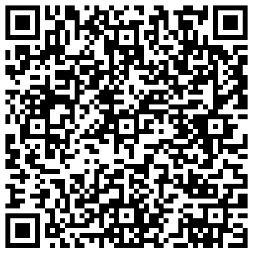

---
date:
    create: 2025-10-17
tags:
    - SSL
    - Certificate
---
# SSL Certificate
The SSL Certifcate should be downloaded from: [SSL Proxy Certificate](https://wavenetcloud.netsweeper.com/webadmin/tools/download_proxy_cert.php)

You can scan the below QR code for manual installation on a mobile device:

