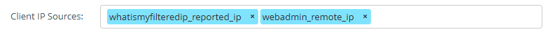
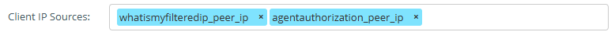

---
date:
    created: 2025-10-21
---

# Troubleshooting

## Wagent not checking in

Is it just one wagent from the school or **ALL** 

If just a single agent is the user a member of the correct "nsw_" group

If **ALL** wagents fail to check-in it is worth checking if the "Client IP Source" in the webadmin need changing, to do this go to:

"Tool" -> "Agent" and find the Agent for the customer, once in the Agent config the "Client IP Source" default shold be "whatsmyfilteredip_reported_ip" and "webadmin_remote_ip"

If we change this to "whatismyfilteredip_peer_ip" and "agentauthorization_peer_ip"

Does the Wagent now check-in under clients?