---
date:
    created: 2025-10-17
---
# Windows Active Directory Setup

## Windows Active Directory Sync

### Netsweeper Service Account

Create an account for the Netsweeper user, this user account only need to be a member of “Domain Users” and should NOT be a “Domain Administrator”

First check the “Advanced Features” is enabled under the View menu in Active Directory.

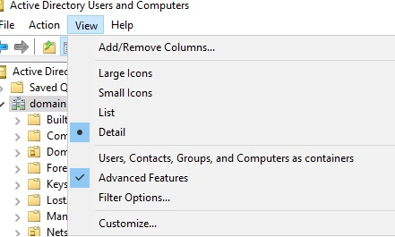

If needed create a new Organisational Unit for this user otherwise create this user account with other service accounts.

Right click on the white space in the folder and select “New” -> “User”

Fill out the form naming the account to fit in with the schools’ naming conventions. Click “Next” when done.

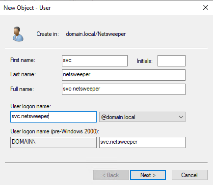

Set a complex password and tick the “Password never expires” box, then click “Next”

On the next screen, click “Finish”

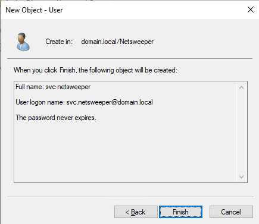

Once we have created the user either double click on the user account or right click and select “Properties”

When the screen loads you should the “Attribute Editor” tab, if not go back and make sure you enabled “Advanced Features” under the view menu. Select the “Attribute Editor” tab.

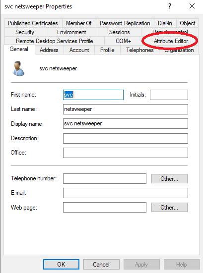

In the “Attribute Editor" tab scroll down and find the entry “distinguishedName” and click the “View” button. The value will look something like this: “CN=svc netsweeper,OU=Netsweeper,DC=domain,DC=local” make a note of this value Netsweeper requires this for the LDAP Sync.

### Create Filtering Groups

To create the filtering groups go to the “Organisational Unit” where you store Active Directory groups or create a new location. Right click in the white space on the right and select “New” -> “Group”

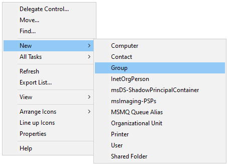

The Group name should be set here with the prefix nsw_
So in the example below we have setup the filtering group for staff with the name nsw_staff

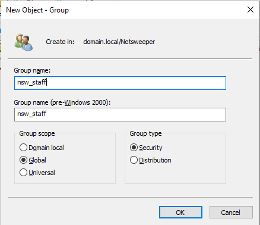

Once the groups have been created add the required users to the group, groups can be nested in here but be careful making sure a user doesn’t end up being a member of multiple filtering groups.

### Deploying SSL Certificate

Before anything we need to grab a copy of the SSL certificate for Netsweeper this can be downloaded from:

[SSL Proxy Certificate](https://wavenetcloud.netsweeper.com/webadmin/tools/download_proxy_cert.php)

Create a new Group Policy Object named something like "SSL"

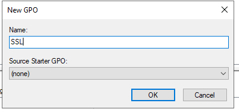

Right click and "Edit" the new policy

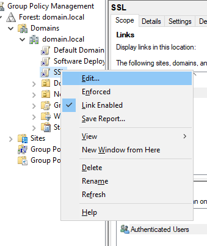

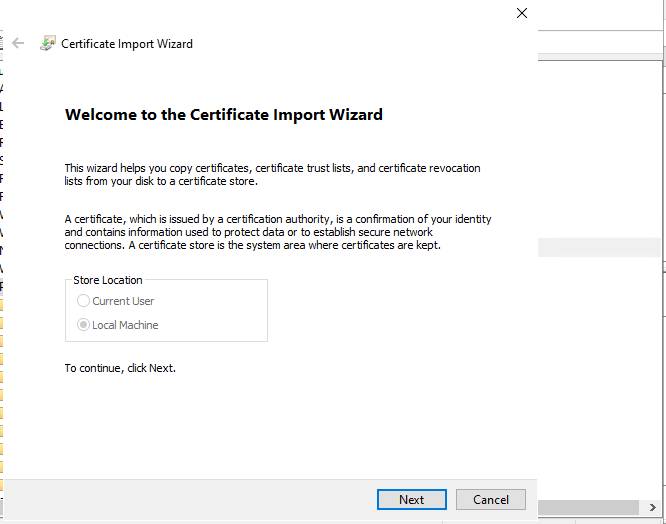

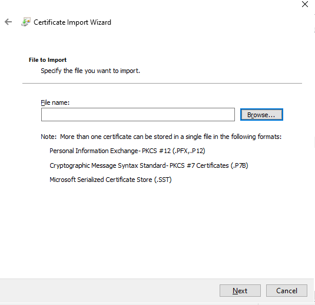

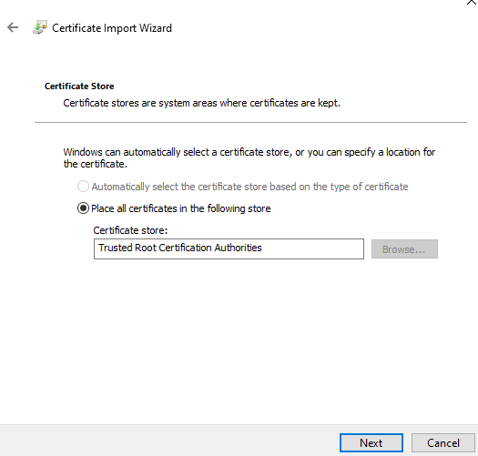

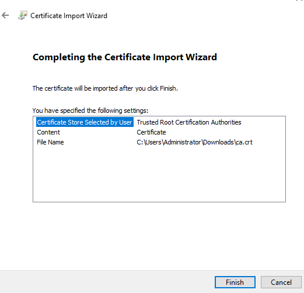

### wagent build MST

### Clinet Filter build MST

### Windows Group Policy

#### Deploy the Wagent

#### Deploy the Client Filter

### Windows Manual Installation