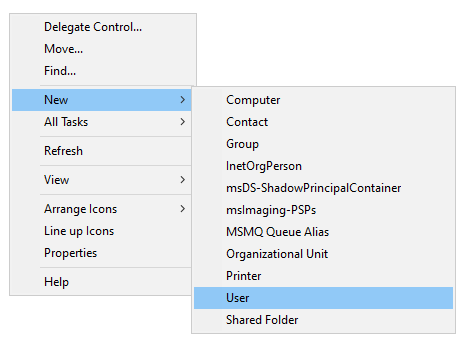
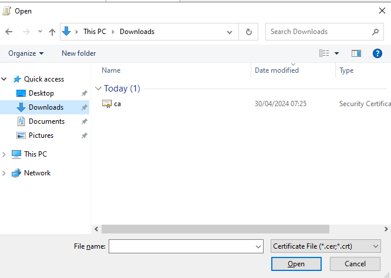
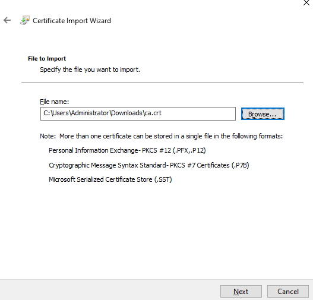
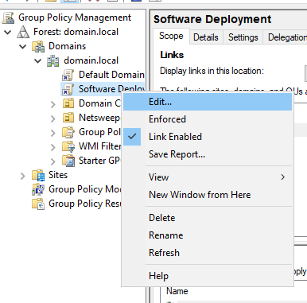
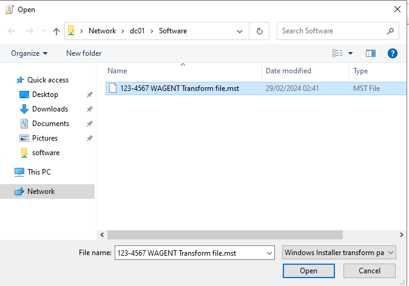
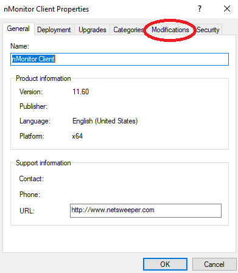

---
date:
    created: 2025-10-17
---
# Windows Active Directory Setup

## Windows Active Directory Sync

### Netsweeper Service Account

Create an account for the Netsweeper user, this user account only need to be a member of “Domain Users” and should NOT be a “Domain Administrator”

First check the “Advanced Features” is enabled under the View menu in Active Directory.

If needed create a new Organisational Unit for this user otherwise create this user account with other service accounts.

Right click on the white space in the folder and select “New” -> “User”

Fill out the form naming the account to fit in with the schools’ naming conventions. Click “Next” when done.

Set a complex password and tick the “Password never expires” box, then click “Next”

On the next screen, click “Finish”

Once we have created the user either double click on the user account or right click and select “Properties”

When the screen loads you should the “Attribute Editor” tab, if not go back and make sure you enabled “Advanced Features” under the view menu. Select the “Attribute Editor” tab.

In the “Attribute Editor" tab scroll down and find the entry “distinguishedName” and click the “View” button. The value will look something like this: “CN=svc netsweeper,OU=Netsweeper,DC=domain,DC=local” make a note of this value Netsweeper requires this for the LDAP Sync.

## Create Filtering Groups

To create the filtering groups go to the “Organisational Unit” where you store Active Directory groups or create a new location. Right click in the white space on the right and select “New” -> “Group”

The Group name should be set here with the prefix nsw_
So in the example below we have setup the filtering group for staff with the name nsw_staff

Once the groups have been created add the required users to the group, groups can be nested in here but be careful making sure a user doesn’t end up being a member of multiple filtering groups.

## Windows Group Policy

### Deploying SSL Certificate

Before anything we need to grab a copy of the SSL certificate for Netsweeper this can be downloaded from:

[SSL Proxy Certificate](https://wavenetcloud.netsweeper.com/webadmin/tools/download_proxy_cert.php)

Create a new Group Policy Object named something like "SSL"

Right click and "Edit" the new policy

### Deploy the Wagent

The WAgent can be installed prior to going live with the filtering system. **Unless we are doing a Netsweeper to Netsweeper migration**

In group policy management create a new group policy, setting the name to fit in with the schools group policy naming conventions.

In this example we call the group policy “Software Deployment”

Once created location the group policy and right click on this and select “Edit”

Once this opens browse to “Computer Configuration” -> “Policies” -> “Software Settings” -> “Software installation”!

Right click on the white space and select “New” -> “Package”

Here browse to the UNC path of the share where the software is stored. In the below example we browse to the location \DC01\Software and select the MSI package named “Netsweeper Workstation Agent - 4.40.54.54-windows.msi” and click “Open”

### Deploy the Client Filter

nMonitor is the software required for the filtering with onGuard, this should be deployed when ready to “Go Live”

In group policy management create a new group policy, setting the name to fit in with the schools group policy naming conventions.

In this example we call the group policy “Software Deployment”

Once created location the group policy and right click on this and select “Edit”

Once this opens browse to “Computer Configuration” -> “Policies” -> “Software Settings” -> “Software installation”!

Right click on the white space and select “New” -> “Package”

Here browse to the UNC path of the share where the software is stored. In the below example we browse to the location \DC01\Software and select the MSI package named “nMonitor Client – 11.60.54.1 win64.msi” and click “Open”

Once this has been selected, and clicked “Open” the next screen we need to change the default option from “Assigned” to “Advanced”

When the option has been set to “Advanced” click Ok. Then select the tab “Modifications” on the screen that loads.

On the “Modifications” screen click “Add” and you should see the MST file, assuming you have stored this in the same location as the MSI installation file.

Once the MST is selected, click Ok.

On the next screen, click OK again and this is now configured.

