# Windows Client Filter
## version 12.x

If deploying version 12 the latest version should be used, this is currently [v12.60.55.55](https://helpdesk.netsweeper.com/docs/9_2_Docs/9_2_Netsweeper_Docs/Content/Client_Filter/Client_Filter_Release_Notes/12_Client_Filter_Releases_and_Downloads/12_60_Client_Filter_Release_and_Downloads.htm){:target="_blank"}

## version 13.x

The client filter v13 has now reached GA so this should be the preferred version to deploy / upgrade to: [v13.50](https://helpdesk.netsweeper.com/docs/9_2_Docs/9_2_Netsweeper_Docs/Content/Client_Filter/Client_Filter_Release_Notes/13_Client_Filter_Release_and_Downloads/13_50_Client_Filter_Release_and_Downloads.htm){:target="_blank"}

Other than some small visual changes, the main change is the configuration is now protected. We have to either set the "Uninstall Password" in the webadmin, or the customer will have to give support the 6 digit number generated by the client

### Getting the Security Key
#### Client Side
Right click on the client filter icon and select settings

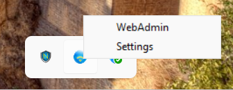

In the settings check the "Policy Server" and "Brand" then click "Configure"

!!! Warning "Settings"
    If the Policy Server is wrong then this will not work. If the Brand is wrong find or create the Brand referenced.

If the password hasn't been set, click on "Forgot/Key"

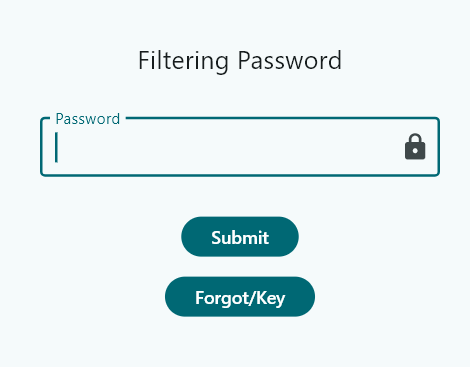

you will now have the "Security Key" needed for the webadmin.

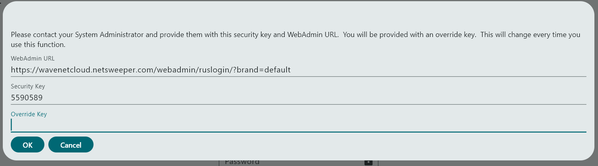

Enter the "Override Key" generated in the webadmin, and click "Ok"

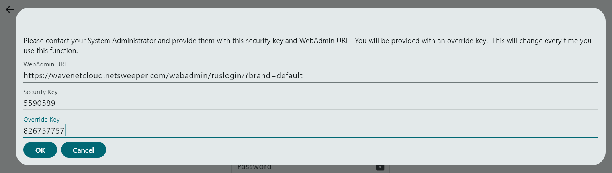

Now you should be able to change the "Policy Server" and or the "Brand" or click on "Advanced" to alter the client settings. 

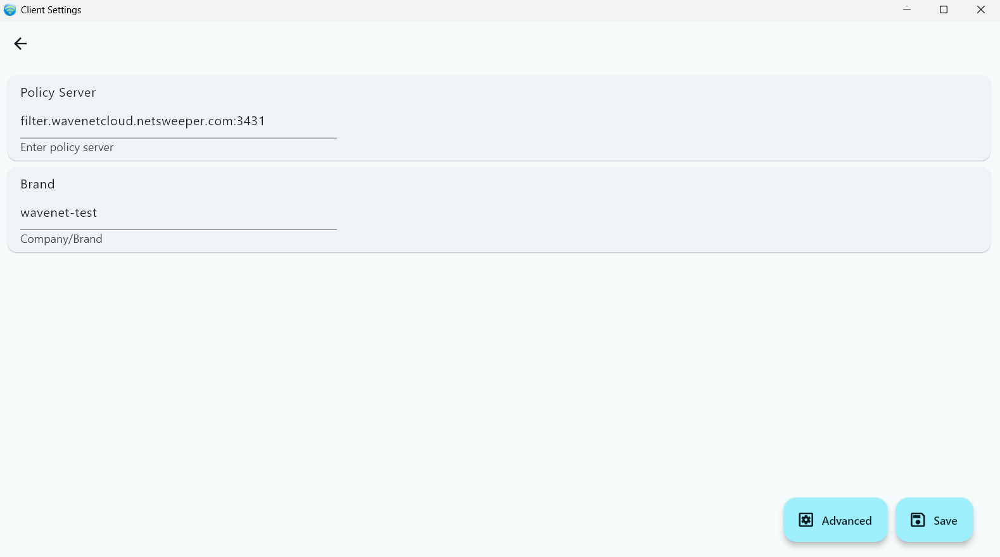

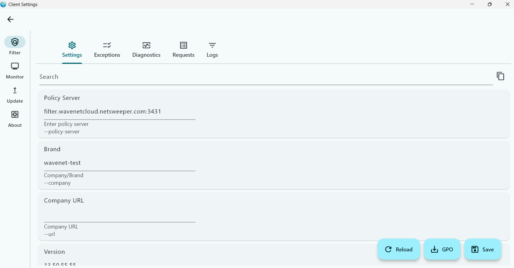

if you click on "About" you can download a zip file for troubleshooting, Netsweeper support may request this.

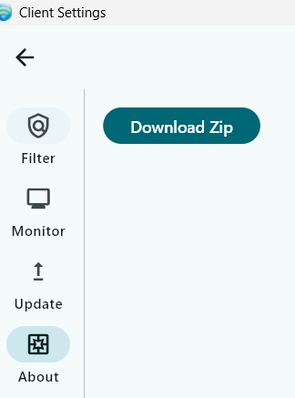

#### Webadmin Side
Under "Tools" -> "Client Filter Settings" search for the customers "Brand" and go into the "Uninstall Key" section of the configuraiton

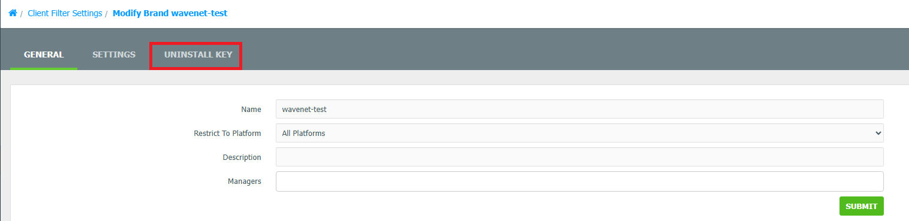

Now click on the "Mode" dropdown and select "RUS"

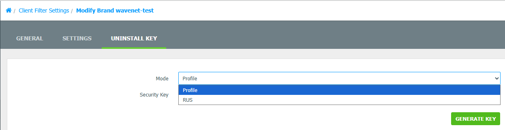

In the "Security Key" put the 7 digit "Security Key" the customer gives you

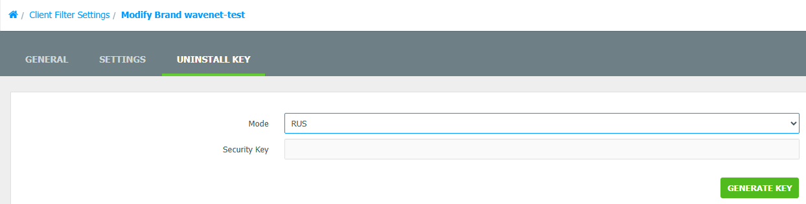

This will generate a code to give to the customer to access the settings. 

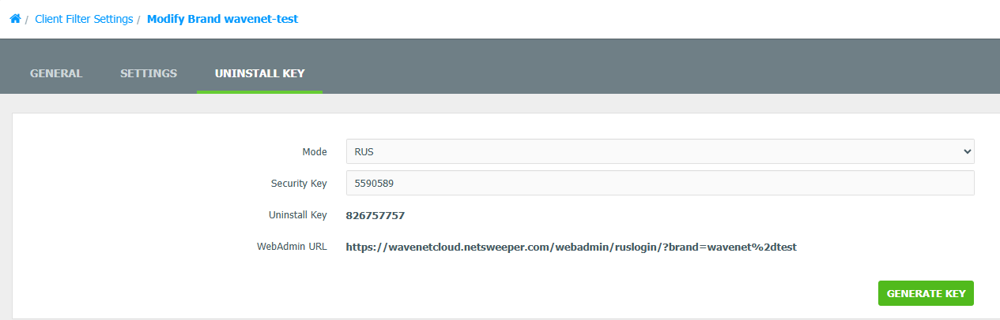

### Setting the Uninstall Password

To set the uninstall password in the webadmin, under "Tools" -> "Client Filter Settings" search for the customers "Brand" and go into the "Settings" section

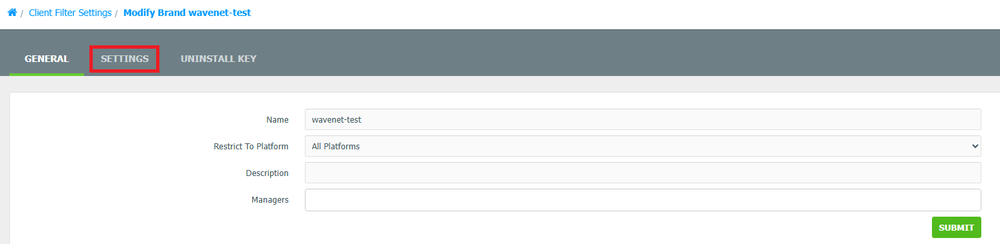

Make sure "Global Uninstall Password setting" is set to "Set Global Uninstall Password", and then set the desired password in the "Global Uninstall Password" below. Then click "Submit"

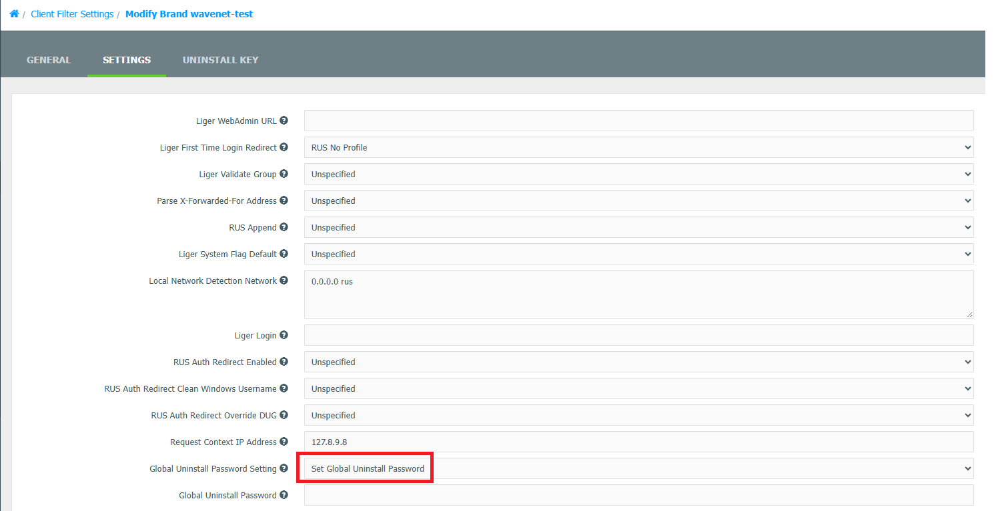

!!! Warning "Setting Password"
    It can take a while for the client filter to check in and pick up the password you have set in here. Any password set here should be logged
