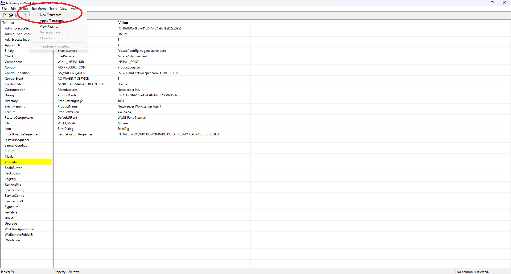
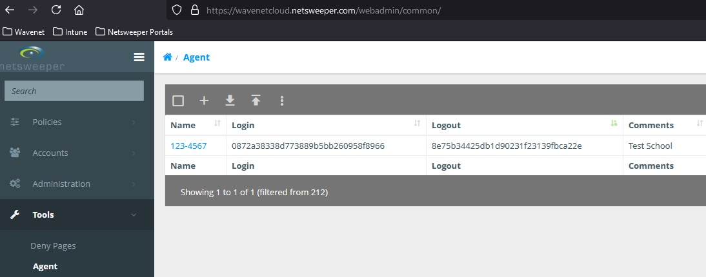
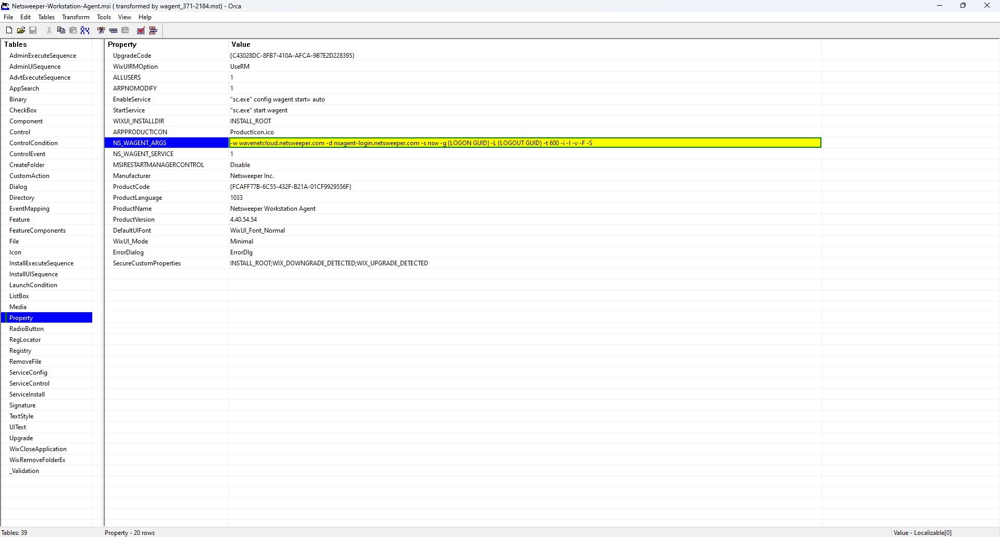
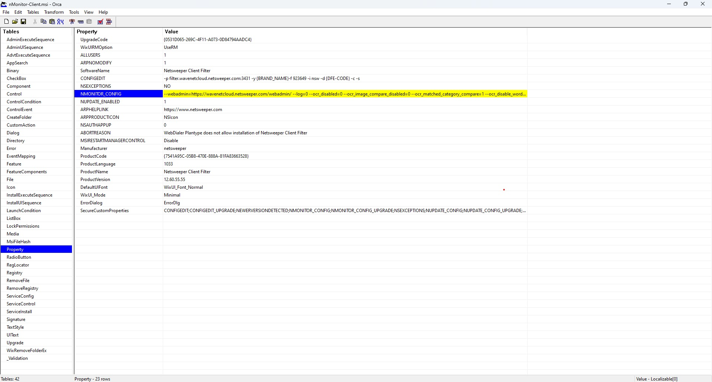

---
date:
    created: 2025-10-21
---
# Windows Build Clients

To create the Netsweeper Windows agents you need to be able to edit the MSI files, to do this you will need to install ORCA, below is the Microsoft link on how to do this:

[Installing ORCA](https://learn.microsoft.com/en-us/windows/win32/msi/orca-exe){:target="_blank"}

## wagent build MST

Download the latest GA version from: [Netsweeper Helpdesk](https://helpdesk.netsweeper.com/docs/8_2_Docs/8_2_Netsweeper_Docs/Content/Release_Notes/WAGENT_Release_Notes/Contents__Wagent_Release_Notes.htm){:target="_blank"}

Open Microsoft ORCA and open the WAGent.MSI, then go to "Transform" -> "New Transform"



On the left select "Property" and we need to update the NS_WAGENT_ARGS line, with the following

``` bash
-w wavenetcloud.netsweeper.com -d nsagent-login.netsweeper.com -s nsw -g {LOGON_GUID} -L {LOGOUT_GUID} -t 600 -i -l -v -F -S
```
Change the LOGON and LOGOUT GUIDs with the GUID for the WAgent from the Netsweeper page "Tools" -> "Agent"





## Client Filter build MST

Download the latest GA version from: [Netsweeper Helpdesk](https://helpdesk.netsweeper.com/docs/8_2_Docs/8_2_Netsweeper_Docs/Content/Client_Filter/Client_Filter_Release_Notes/12_Client_Filter_Releases_and_Downloads/Contents_Client_Filter_12_Releases_and_Downloads.htm){:target="_blank"}

Open Microsoft ORCA and open the WAGent.MSI, then go to "Transform" -> "New Transform"



On the left select "Property" and we need to update the following lines CONFIGEDIT, NMONITOR_CONFIG, NUPDATE_ENABLED, with the following


CONFIGEDIT
``` bash
-p filter.wavenetcloud.netsweeper.com:3431 -y {BRAND_NAME} -f 923649 -i nsw -d {DFE-CODE} -c -s
```

NMONITOR_CONFIG
``` bash
--webadmin=https://wavenetcloud.netsweeper.com/webadmin/ --log=0 --ocr_disabled=0 --ocr_image_compare_disabled=0 --ocr_matched_category_compare=1 --ocr_disable_words_compare=0 --ocr_disable_input_compare=0 --ocr_timeout_recapture=5 --keylog_disabled=0 --keylog_buffer_size=1024 --keylog_timeout_send=1 --keylog_timeout_clear=30 --image_quality=50 --image_target_width=0 --image_target_height=0 --tray_disabled=0 --tray_menu_disabled=0
```

NUPDATE_ENABLED
``` bash
1
```

Once the settings have been set go to "Transforms" -> "Generate Transform" and then save the MST file

