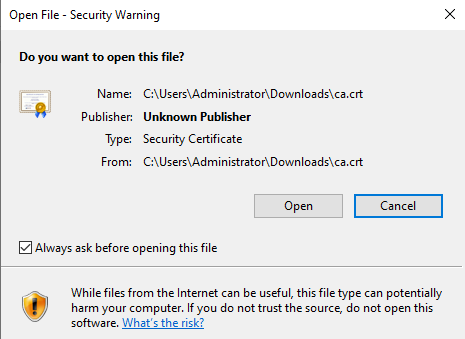
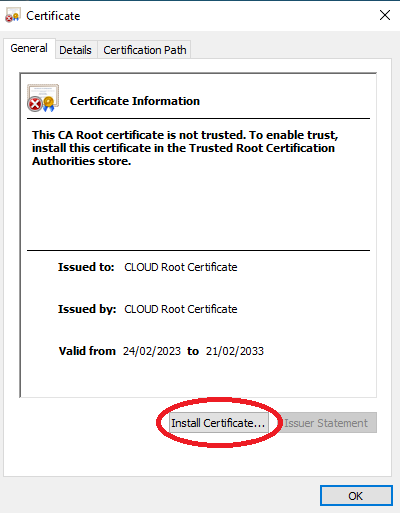
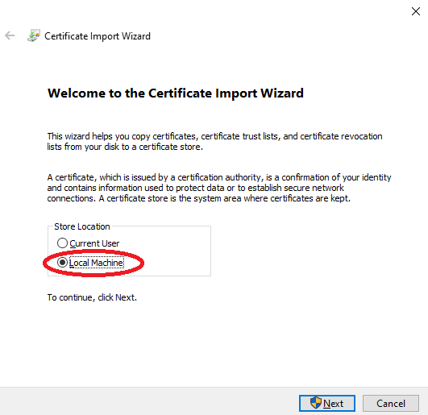
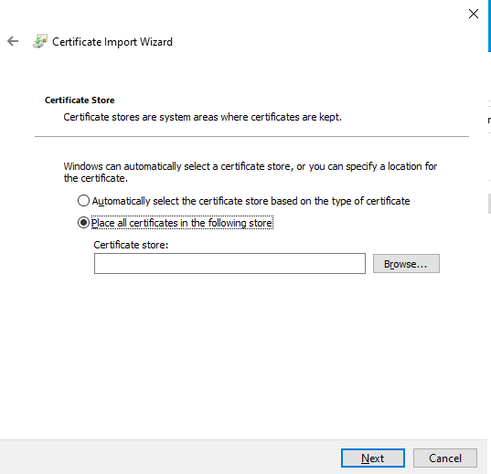
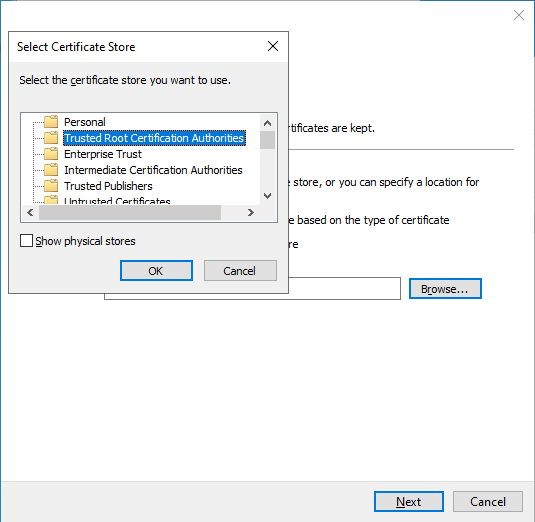
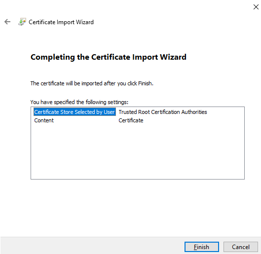
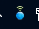

# Windows Standalone

## Manual SSL Installation

Download the SSL Certificate: 

[SSL Proxy Certificate](https://wavenetcloud.netsweeper.com/webadmin/tools/download_proxy_cert.php)













## Manaul wagent Installation

open a command prompt with Administrator privileges, this must be CMD and not Powershell.

The command we need to run to install the software is (change the TRANSFORMS=… part to match the MST for the school):

``` cmd
msiexec /i "wagent.msi" /qn TRANSFORMS="123-4567 wagent transform filemst.mst"
```

## Manual Client Filter Installation

open a command prompt with Administrator privileges, this must be CMD and not Powershell.

The command we need to run to install the software is (change the TRANSFORMS=… part to match the MST for the school):

``` cmd
msiexec /i "nMonitor Client.msi" /qn TRANSFORMS="123-4567 nMonitor transform filemst.mst"
```

Once this is installed you will see the below icon in the system tray

